# 옷 쇼핑몰 AI 이미지 성공/실패 정리

AI 이미지 생성 결과 중 실패 사례를 **Logo / Mismatch / Tone & Mood** 기준으로 분류했습니다.
파일명은 한글 간단 이름 기준에 맞춰 영어 이름도 함께 정리했습니다.

## 1. Logo / 로고 오류

| 이미지 | 새 파일명 | 간단 이름 | 실패 이유 |
|---|---|---|---|
| 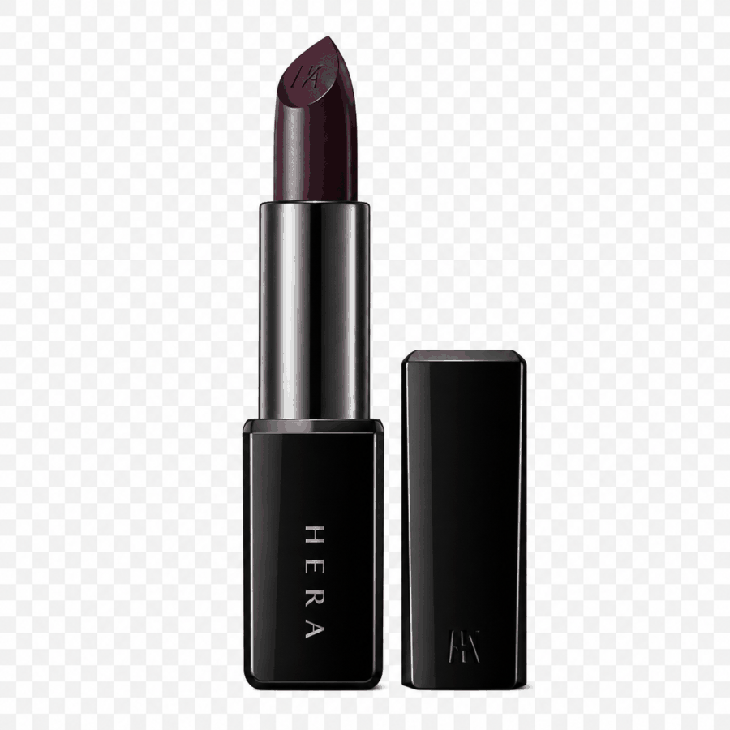 | `Logo/1-01_wrong_logo_serum.png` | 로고 오류 세럼 | 쇼핑몰 로고와 다르게 생성됨 |
| 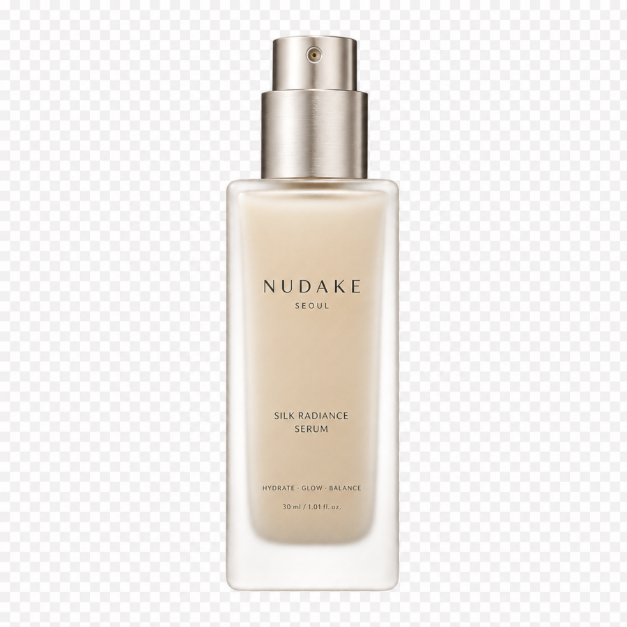 | `Logo/1-02_wrong_logo_foundation.png` | 로고 오류 파운데이션 | 쇼핑몰 로고와 다르게 생성됨 |
| 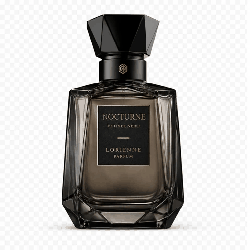 | `Logo/1-03_wrong_logo_black_perfume.png` | 로고 오류 블랙 퍼퓸 | 쇼핑몰 로고와 다르게 생성됨 |

## 2. Mismatch / 의도와 다름

| 이미지 | 새 파일명 | 간단 이름 | 실패 이유 |
|---|---|---|---|
| 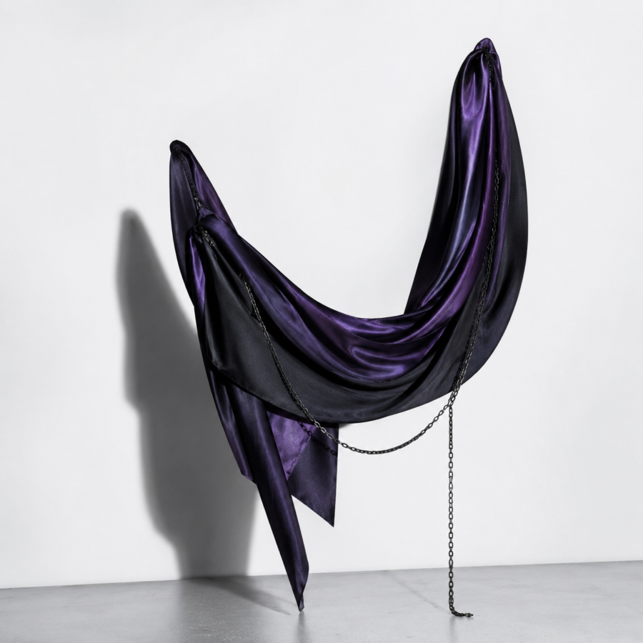 | `Mismatch/2-01_floating_scarf.png` | 붕 뜬 스카프 | 오브젝트가 붕 떠 보임 |
| 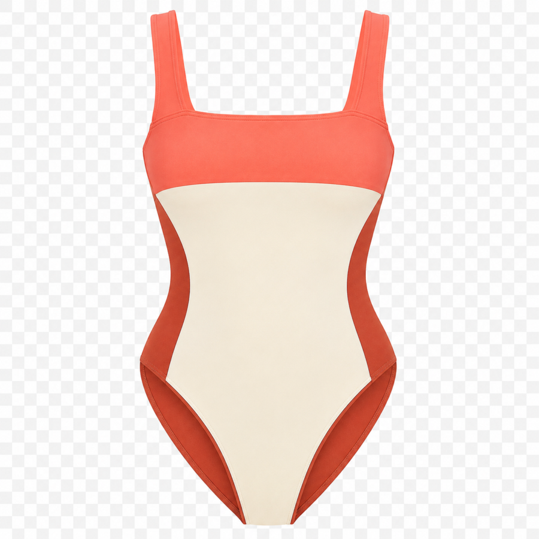 | `Mismatch/2-02_too_bright_swimsuit.png` | 원색 수영복 | 쨍한 원색이 튀어 블랙/차콜/실버/버건디 중심 무드와 맞지 않음 |
| 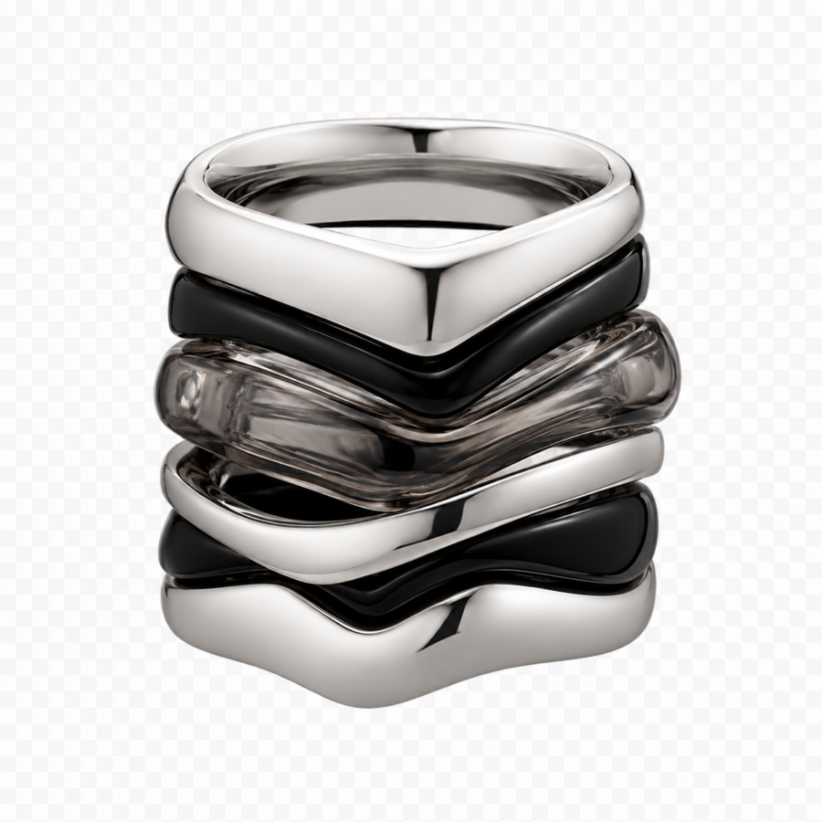 | `Mismatch/2-03_overlapped_ring.png` | 겹친 링 | 디테일이 여러 개 겹쳐져 부자연스러움 |
| 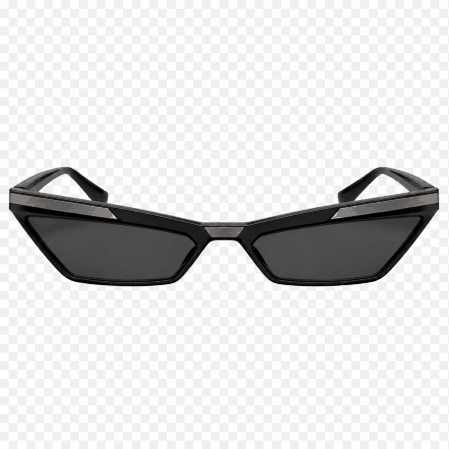 | `Mismatch/2-04_wrong_angle_sunglasses.png` | 방향 오류 선글라스 | 사이드 방향이어야 하는데 정면 방향으로 생성됨 |
| 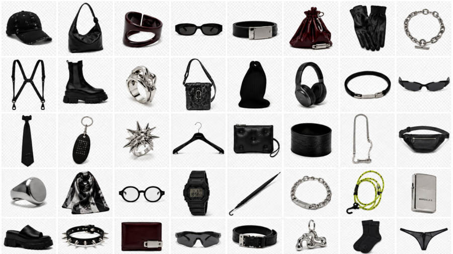 | `Mismatch/2-05_grid_output_image_set.png` | 스프레드 출력 이미지 모음 | 개별 이미지를 요청했으나 스프레드/그리드 형식으로 생성됨 |
| 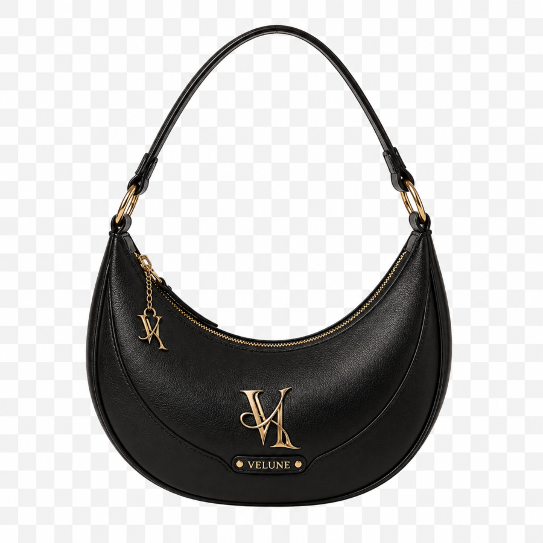 | `Mismatch/2-06_wrong_composition_handbag.png` | 구도 오류 핸드백 | 원하던 구도와 다르게 생성됨 |
| 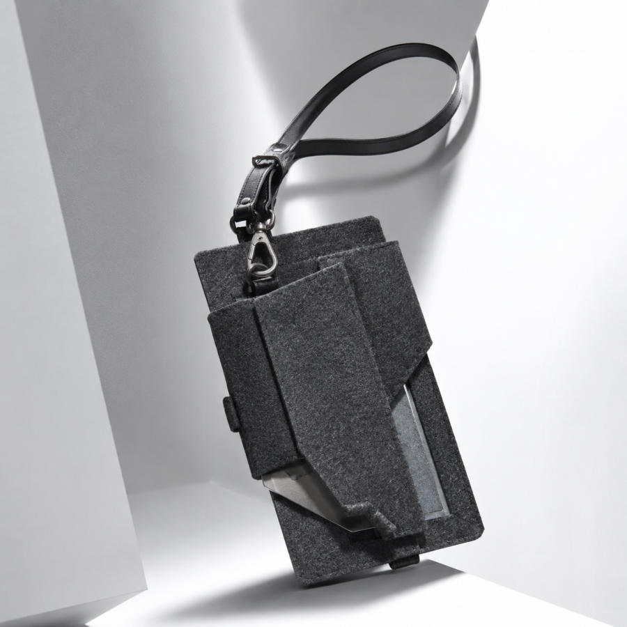 | `Mismatch/2-07_nonwoven_texture.png` | 부직포 질감 오브젝트 | 부직포처럼 보여 실제 제품 질감과 맞지 않음 |
| 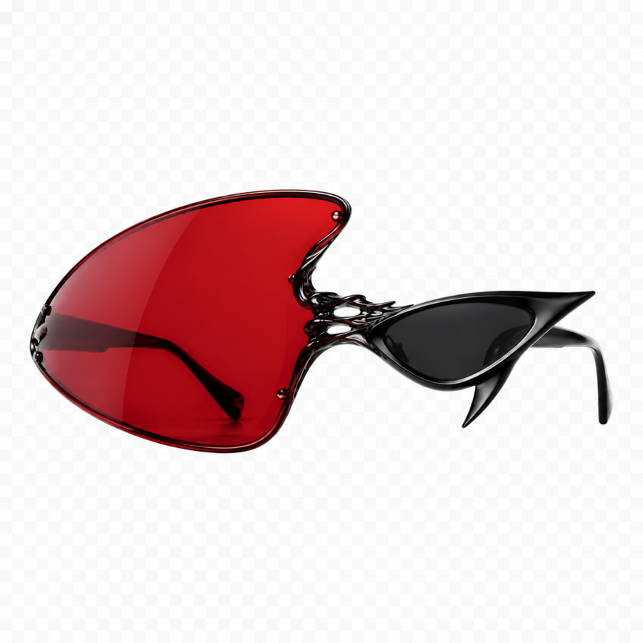 | `Mismatch/2-08_mismatched_lens.png` | 안경알 불일치 선글라스 | 좌우 안경알 형태가 서로 맞지 않음 |
| 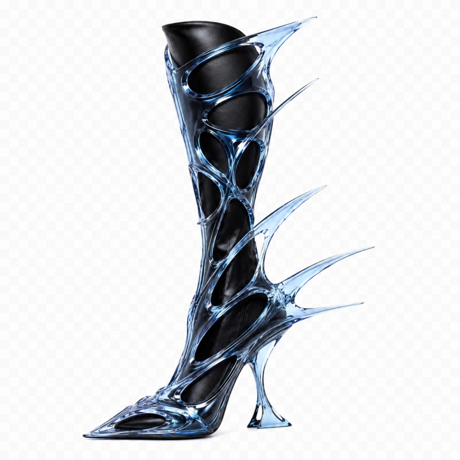 | `Mismatch/2-09_mood_mismatch_mannequin.png` | 톤앤무드 불일치 슈즈 마네킹 | 신발 신은 마네킹 연출이 전체 톤앤무드와 맞지 않음 |

## 3. Tone & Mood / 톤앤무드 실패

| 이미지 | 새 파일명 | 간단 이름 | 실패 이유 |
|---|---|---|---|
|  | `Tone & Mood/3-01_too_bright_pleated_skirt.png` | 원색 주름 치마 | 쨍한 원색이 튀어 블랙/차콜/실버/버건디 중심 무드와 맞지 않음 |
|  | `Tone & Mood/3-02_too_bright_blue_jacket.png` | 원색 블루 재킷 | 쨍한 원색이 튀어 브랜드 톤과 맞지 않음 |
|  | `Tone & Mood/3-03_young_mood_cotton_jacket.png` | 연령대 불일치 코튼 재킷 | 전체 톤앤무드와 타깃 연령대에 맞지 않음 |
|  | `Tone & Mood/3-04_mood_mismatch_handbag.png` | 무드 불일치 핸드백 | 전체 톤앤무드와 타깃 연령대에 맞지 않음 |
|  | `Tone & Mood/3-05_mood_mismatch_top.png` | 무드 불일치 상의 | 전체 톤앤무드와 타깃 연령대에 맞지 않음 |
|  | `Tone & Mood/3-06_toylike_compact.png` | 장난감 같은 컴팩트 | 장난감처럼 보여 고급 쇼핑몰 무드와 맞지 않음 |
|  | `Tone & Mood/3-07_toylike_cushion.png` | 장난감 같은 쿠션 | 장난감처럼 보여 고급 쇼핑몰 무드와 맞지 않음 |
|  | `Tone & Mood/3-08_mood_mismatch_top_a.png` | 무드 불일치 상의 | 전체 톤앤무드와 타깃 연령대에 맞지 않음 |
|  | `Tone & Mood/3-09_mood_mismatch_top_b.png` | 무드 불일치 상의 | 전체 톤앤무드와 타깃 연령대에 맞지 않음 |

